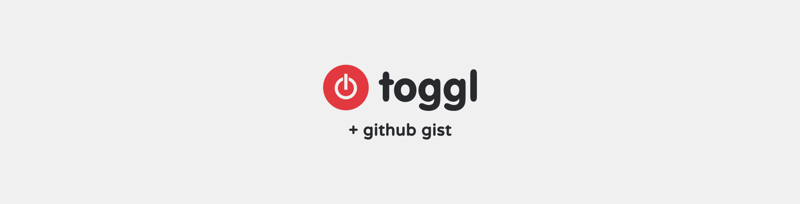

  

  
  

  📊 Update a pinned gist to contain your weekly <a href="https://toggl.com/">Toggl</a> stats. 📊

---
> 📌✨ For more pinned-gist projects like this one, check out: https://github.com/matchai/awesome-pinned-gists

## 🎒 Prep Work
1. Create a new public GitHub Gist (https://gist.github.com/)
2. Create a token with the `gist` scope and copy it. (https://github.com/settings/tokens/new)
3. Copy your `API token` from [your Toggl profile](https://toggl.com/app/profile)
4. Copy your `Workspace ID` from the URL in your [project view](https://toggl.com/app/projects/)

## 🖥 Project Setup
1. Fork this repo
2. Go to your fork's `Settings` > `Secrets` > `Add a new secret` for each repository secret (below)
3. Set filter options in `.github/workflows/schedule.yml` (also below)

## 🔥 Filter Options
- **FILTER_BY_BILLABLE:** Filters out specific entries without a specific billable state. 
  - Valid options: `yes`, `no`, or `both`. 
  - Defaults to `both`.
  - Requires a paid Toggl plan.
- **FILTER_BY_TAG:** Filters out specific entries without a specific tag. 
  - Valid options: `false` to disable the filter, `0` to filter out all entries with a tag, or a comma-separated list of tag ids. 
  - Defaults to a random tag id.
  - You can get tag ids by utilizing the [Toggl API](https://github.com/toggl/toggl_api_docs/blob/master/chapters/workspaces.md#get-workspace-tags)
- **FILTER_BY_USER:** Shows only work done by a specific user in a workspace 
  - Valid options: `false` to disable the filter or a comma-separated list of user ids. 
  - Defaults to a `false`.
  - You can get user ids by utilizing the [Toggl API](https://github.com/toggl/toggl_api_docs/blob/master/chapters/workspaces.md#get-workspace-users)

## 🤫 Repository Secrets
- **GIST_ID:** The ID portion from your gist url `https://gist.github.com/<github username>/`**`7887b94cbb97a90fe08498c4744bad4b`**.
- **GH_TOKEN:** The GitHub token generated above.
- **TOGGL_API_TOKEN:** The API key you got from your Toggl profile above.
- **TOGGL_WORKSPACE_ID:** The ID portion from a workspace-specific Toggl url you copied above, e.g. `https://toggl.com/app/projects/`**`3295766`**`/list/`.

## ✨ Credits
This code was heavily inspired (with some parts taken over) by [@jacc's music-box](https://github.com/jacc/music-box/).

## 📄 License

[toggl-box](https://github.com/tobimori/toggl-box) is licensed under the [MIT License](https://github.com/tobimori/toggl-box/blob/master/LICENSE)
